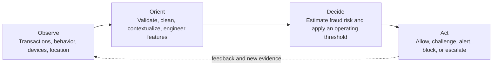

<div align="center">

# Explainable AI-Powered Fraud Detection

### Risk analytics for rare-event digital payment transactions

An auditable machine-learning study that turns highly imbalanced transaction data into a validation-driven fraud alert policy - with reproducible experiments, business-facing evaluation, and an OODA-inspired decision framework.

[](https://www.python.org/)
[](https://scikit-learn.org/)
[](#scope-and-status)
[](https://uni-pr.edu/)

[Read the report](report/Rehan_Khaliq_Fraud_Detection_Report_FINAL.pdf) ·
[Explore the analysis](src/run_analysis.py) ·
[Review the results](output/analysis/analysis_summary.json) ·
[Access the dataset](https://www.kaggle.com/datasets/mlg-ulb/creditcardfraud)

</div>

---

## Overview

Fraud detection is not only a classification problem. An operational system must continuously observe new activity, interpret risk in context, make a defensible decision, and trigger an appropriate response.

This project was developed for the **Prishtina International Summer University (PISU) 2026** course **DX: Digital Transformation for Business - MCP-Based RAG** at the **University of Prishtina**. It combines two complementary layers:

1. **A reproducible machine-learning implementation** that validates and cleans transaction data, compares fraud classifiers, selects an operating threshold using validation data only, and evaluates the final policy on an untouched test set.
2. **A conceptual multi-agent decision architecture** described in the report, using the OODA loop - Observe, Orient, Decide, Act - to connect prediction with explainability, human review, and operational response.

> **Scope:** The repository implements the offline analytics, model-selection, threshold-selection, evaluation, and reporting pipeline. The multi-agent orchestration and real-time response layer are architectural proposals discussed in the report, not a deployed production system.

## Why this problem matters

Credit-card fraud is an extreme rare-event problem. In the source data, only **492 of 284,807 transactions** are labeled as fraud - approximately **0.173%**.

This creates a practical challenge: a model can achieve more than 99% accuracy by predicting every transaction as legitimate while detecting no fraud at all. The project therefore emphasizes metrics and decisions that are meaningful under severe class imbalance:

- Precision and recall
- F1 score
- Average Precision and precision-recall curves
- ROC-AUC
- False positives per 1,000 legitimate transactions
- Alert rate and review workload
- Validation-selected operating thresholds

## OODA-inspired fraud decision cycle



The report extends this cycle into a possible multi-agent pipeline containing data-collection, preparation, feature-engineering, prediction, explainability/compliance, response, and human-review agents.

## Implementation map

| Layer | Responsibility | Repository status |
|---|---|---|
| Data ingestion | Load the authoritative Kaggle CSV or retrieve OpenML data ID 1597 | Implemented |
| Data quality | Validate schema and types, identify missing values, remove exact duplicates | Implemented |
| Data partitioning | Create stratified 64/16/20 train-validation-test partitions | Implemented |
| Model training | Compare Dummy Prior, class-weighted Logistic Regression, and Random Forest | Implemented |
| Model selection | Select the learned model using validation Average Precision | Implemented |
| Decision policy | Select the highest-precision validation threshold achieving at least 80% recall | Implemented offline |
| Explainability | Export Random Forest feature importance for anonymized PCA features | Implemented, limited |
| Operational response | Allow, challenge, block, alert, or escalate transactions | Conceptual |
| Multi-agent orchestration | Coordinate specialist agents and human review through the OODA loop | Conceptual |

## Data quality and experimental design

| Item | Value |
|---|---:|
| Original transactions | 284,807 |
| Original fraud cases | 492 |
| Missing values | 0 |
| Exact duplicate rows removed | 1,081 |
| Cleaned transactions | 283,726 |
| Cleaned fraud cases | 473 |
| Cleaned fraud prevalence | 0.167% |
| Train / validation / test | 64% / 16% / 20% |
| Random seed | 42 |
| Partition index overlap | 0 rows |

The test set remains untouched during model and threshold selection. Model selection is based on **validation Average Precision**, while the operating threshold is chosen from validation predictions only.

## Model strategy

### Dummy Prior

Provides a no-skill reference that reflects the class distribution without learning a fraud boundary.

### Logistic Regression

Uses standardized features and balanced class weights. It provides a strong, interpretable linear benchmark for rare-event classification.

### Random Forest

Uses 200 trees, balanced subsampling, bounded depth, minimum leaf-size regularization, and square-root feature sampling. It captures nonlinear relationships while remaining practical to audit and reproduce.

## Verified test results

The **Random Forest** achieved the highest validation Average Precision among the learned models. Its operating threshold of **0.6735** was selected using validation data only.

| Metric | Untouched test-set result |
|---|---:|
| Precision | **95.7%** |
| Recall | **69.5%** |
| F1 score | **0.805** |
| Average Precision | **0.805** |
| ROC-AUC | **0.965** |
| True positives | **66** |
| False positives | **3** |
| False negatives | **29** |
| True negatives | **56,648** |
| False positives per 1,000 legitimate transactions | **0.053** |
| Alert rate | **0.122%** |

These results describe a low-volume, high-precision alert policy: **69 predictions were escalated from 56,746 test transactions, and 66 were confirmed fraud cases**.

<p align="center">
  
  
</p>

> The selected validation policy targeted at least 80% recall, but recall decreased to 69.5% on the untouched test set. This gap is reported rather than hidden because it illustrates why operating policies must be monitored and revalidated on new data.

## Key analytical outputs

| Artifact | Purpose |
|---|---|
| [Analysis summary](output/analysis/analysis_summary.json) | Consolidated data-quality, split, model, threshold, metric, and limitation record |
| [Model comparison](output/analysis/model_comparison.csv) | Default and validation-selected policies for all evaluated models |
| [Validation summary](output/analysis/validation_summary.json) | Model-selection and threshold-selection evidence |
| [Split summary](output/analysis/split_summary.json) | Partition sizes, prevalence, seed, and overlap verification |
| [Feature importance](output/analysis/feature_importance.csv) | Ranked Random Forest importance for anonymized input features |
| [Data-quality summary](output/analysis/data_quality.json) | Source, duplicate-removal, class-count, and prevalence checks |

## Reproduce the analysis

### 1. Clone the repository

```bash
git clone https://github.com/Rekh-225/Explainable-Fraud-Detection-PISU-2026.git
cd Explainable-Fraud-Detection-PISU-2026
```

### 2. Create and activate a virtual environment

Windows PowerShell:

```powershell
python -m venv .venv
.venv\Scripts\Activate.ps1
```

macOS or Linux:

```bash
python3 -m venv .venv
source .venv/bin/activate
```

### 3. Install the pinned dependencies

```bash
python -m pip install --upgrade pip
pip install -r requirements.txt
```

### 4. Provide the dataset

Preferred option: download `creditcard.csv` from the [ULB Credit Card Fraud dataset on Kaggle](https://www.kaggle.com/datasets/mlg-ulb/creditcardfraud) and place it at:

```text
data/raw/creditcardfraud/creditcard.csv
```

If the CSV is not present, the program attempts to retrieve the OpenML mirror using **data ID 1597**.

Raw data is excluded from Git because of repository size and responsible data-distribution practices.

### 5. Run the complete pipeline

```bash
python src/run_analysis.py
```

The program regenerates the metrics, JSON summaries, CSV tables, figures, and serialized selected model under `output/analysis/`.

## Repository structure

```text
.
|-- README.md
|-- requirements.txt
|-- src/
|   `-- run_analysis.py
|-- output/
|   `-- analysis/
|       |-- figures/
|       |-- analysis_summary.json
|       |-- data_quality.json
|       |-- feature_importance.csv
|       |-- model_comparison.csv
|       |-- split_summary.json
|       `-- validation_summary.json
`-- report/
    |-- Rehan_Khaliq_Fraud_Detection_Report_FINAL.pdf
    `-- Rehan_Khaliq_Fraud_Detection_Report_FINAL.docx
```

## Technology stack

| Category | Tools |
|---|---|
| Language | Python 3.12 |
| Data processing | pandas, NumPy |
| Machine learning | scikit-learn |
| Visualization | Matplotlib, seaborn |
| Model persistence | joblib |
| Data sources | Kaggle, OpenML |
| Outputs | JSON, CSV, PNG, PDF, DOCX |

## Responsible interpretation

This project is an offline academic prototype. It is not a production payment-control system and should not be used to approve, decline, block, or investigate real transactions without additional validation and governance.

Important limitations include:

- The dataset covers only two days of transactions from September 2013.
- Features `V1`-`V28` are anonymized PCA components without business-semantic labels.
- Random Forest importance indicates model reliance, not causality or a complete explanation.
- A stratified random split does not simulate future fraud patterns or model drift.
- The dataset does not provide reliable fraud-loss or investigation-cost information.
- High performance on this benchmark does not establish fairness, robustness, or production readiness.
- Human review, access control, monitoring, audit logs, privacy controls, and regulatory assessment would be required in a real deployment.

## Future development

- Time-aware and out-of-time validation
- Probability calibration and cost-sensitive threshold selection
- SHAP-based local and global explanations
- Drift monitoring and scheduled revalidation
- Graph-based fraud relationships and anomaly detection
- Adversarial robustness and fraud-strategy adaptation
- Real-time scoring interfaces and alert-queue integration
- Multi-agent orchestration with explicit human approval gates

## Report

The full student report provides the research motivation, literature context, OODA-based decision structure, conceptual multi-agent design, experimental methodology, evaluation, limitations, and recommendations.

- [Read the final report as PDF](report/Rehan_Khaliq_Fraud_Detection_Report_FINAL.pdf)
- [Download the editable Word document](report/Rehan_Khaliq_Fraud_Detection_Report_FINAL.docx)

## Citation

If this repository supports academic work, please cite it as:

```bibtex
@misc{khaliq2026explainablefraud,
  author       = {Rehan Khaliq},
  title        = {Explainable AI-Powered Fraud Detection and Risk Analytics for Digital Payment Transactions},
  year         = {2026},
  howpublished = {GitHub repository},
  url          = {https://github.com/Rekh-225/Explainable-Fraud-Detection-PISU-2026}
}
```

## Acknowledgments

This work was completed during **PISU 2026 at the University of Prishtina** as part of the course **DX: Digital Transformation for Business - MCP-Based RAG**.

Special thanks to **Prof. Kohei Arai**, **Prof. Arbnor Pajaziti**, the PISU organizers, fellow students, and project collaborators for their teaching, discussions, and feedback.

The transaction dataset was made available by the ULB Machine Learning Group through Kaggle and is also accessible through OpenML data ID 1597.

## Author

**Rehan Khaliq**

- GitHub: [Rekh-225](https://github.com/Rekh-225)
- Project repository: [Explainable-Fraud-Detection-PISU-2026](https://github.com/Rekh-225/Explainable-Fraud-Detection-PISU-2026)

## Usage and licensing

This repository is currently public for academic review, reproducibility, and portfolio demonstration. No formal open-source license has been added yet; standard copyright restrictions therefore apply until a `LICENSE` file is included.

If the project is released under an open-source license later, the license terms should explicitly state whether they cover only the source code or also the written report and generated artifacts.

---

<div align="center">

**Academic prototype · Reproducible analysis · Transparent limitations**

</div>
