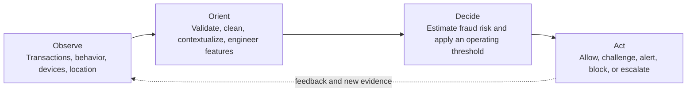
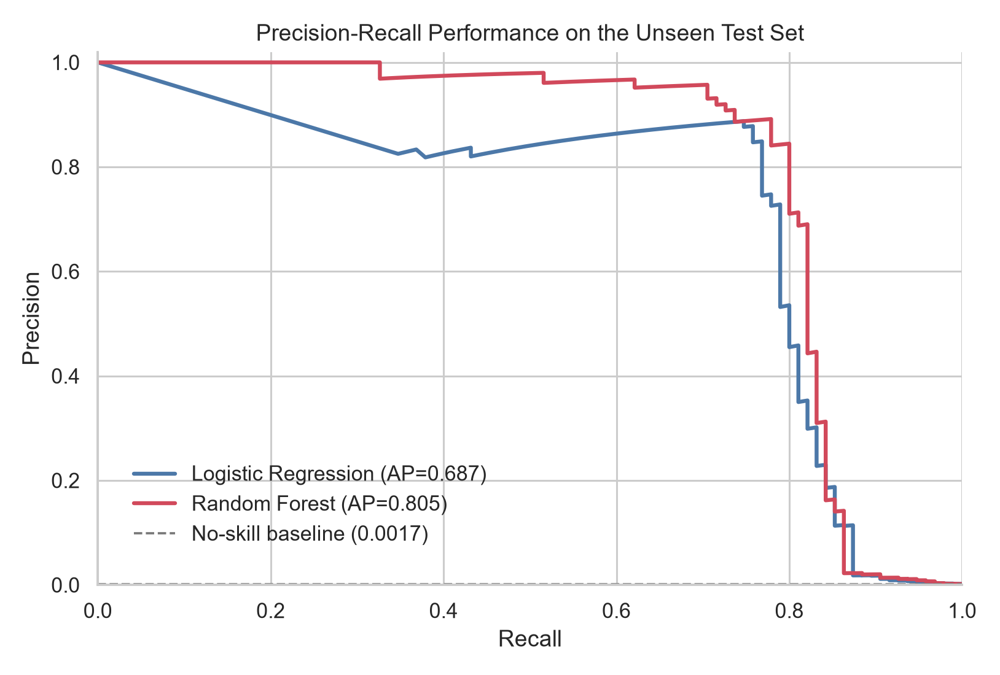
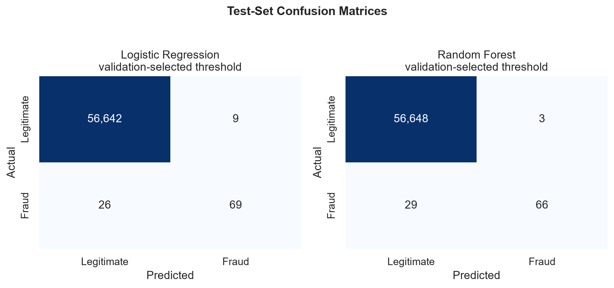
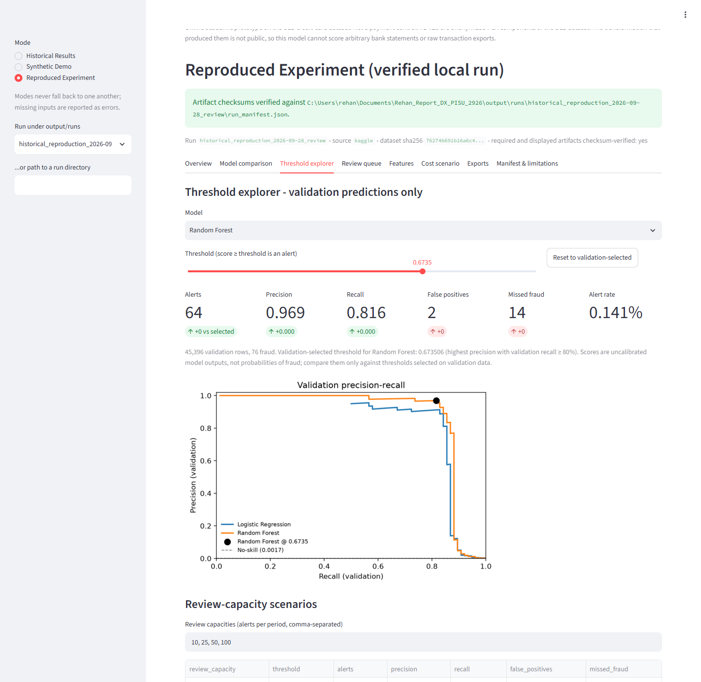

<div align="center">

# Explainable AI-Powered Fraud Detection

### Risk analytics for rare-event digital payment transactions

An auditable machine-learning study that turns highly imbalanced transaction data into a validation-driven fraud alert policy - with reproducible experiments, business-facing evaluation, and an OODA-inspired decision framework.

[](https://www.python.org/)
[](https://scikit-learn.org/)
[](#scope-and-status)
[](https://uni-pr.edu/)

[Read the report](report/Rehan_Khaliq_Fraud_Detection_Report_FINAL.pdf) ·
[Explore the pipeline](src/fraud_pipeline/) ·
[Review the results](output/analysis/analysis_summary.json) ·
[Access the dataset](https://www.kaggle.com/datasets/mlg-ulb/creditcardfraud)

</div>

---

## Overview

Fraud detection is not only a classification problem. An operational system must continuously observe new activity, interpret risk in context, make a defensible decision, and trigger an appropriate response.

This project was developed for the **Prishtina International Summer University (PISU) 2026** course **DX: Digital Transformation for Business - MCP-Based RAG** at the **University of Prishtina**. It combines two complementary layers:

1. **A reproducible machine-learning implementation** that validates and cleans transaction data, compares fraud classifiers, selects an operating threshold using validation data only, and evaluates the final policy on an untouched test set.
2. **A conceptual multi-agent decision architecture** described in the report, using the OODA loop - Observe, Orient, Decide, Act - to connect prediction with explainability, human review, and operational response.

> **Scope:** The repository implements the offline analytics, model-selection, threshold-selection, evaluation, and reporting pipeline. The multi-agent orchestration and real-time response layer are architectural proposals discussed in the report, not a deployed production system.

## Why this problem matters

Credit-card fraud is an extreme rare-event problem. In the source data, only **492 of 284,807 transactions** are labeled as fraud - approximately **0.173%**.

This creates a practical challenge: a model can achieve more than 99% accuracy by predicting every transaction as legitimate while detecting no fraud at all. The project therefore emphasizes metrics and decisions that are meaningful under severe class imbalance:

- Precision and recall
- F1 score
- Average Precision and precision-recall curves
- ROC-AUC
- False positives per 1,000 legitimate transactions
- Alert rate and review workload
- Validation-selected operating thresholds

## OODA-inspired fraud decision cycle



The report extends this cycle into a possible multi-agent pipeline containing data-collection, preparation, feature-engineering, prediction, explainability/compliance, response, and human-review agents.

## Implementation map

| Layer | Responsibility | Repository status |
|---|---|---|
| Data ingestion | Load an explicitly declared dataset file (Kaggle CSV, OpenML mirror, or synthetic fixture); no silent substitution | Implemented |
| Data quality | Validate schema, numeric and finite values, binary labels, class counts; remove exact duplicates | Implemented, tested |
| Data partitioning | Create stratified 64/16/20 train-validation-test partitions with membership fingerprints | Implemented, tested |
| Model training | Compare Dummy Prior, class-weighted Logistic Regression, and Random Forest | Implemented |
| Model selection | Select the learned model using validation Average Precision | Implemented |
| Decision policy | Select the highest-precision validation threshold achieving at least 80% recall | Implemented offline |
| Explainability | Export Random Forest feature importance for anonymized PCA features | Implemented, limited |
| Reproducibility | Per-run manifest (dataset checksum, feature order, split fingerprints, content-overlap check, model config, environment, artifact checksums), non-executable Logistic Regression coefficient export, synthetic-data CI. Checksums establish integrity, not authenticity; the UI verifies content on every rerun, cross-checks files against each other, classifies provenance from evidence and never unpickles models | Implemented, tested |
| Operational response | Allow, challenge, block, alert, or escalate transactions | Conceptual |
| Multi-agent orchestration | Coordinate specialist agents and human review through the OODA loop | Conceptual |

## Data quality and experimental design

| Item | Value |
|---|---:|
| Original transactions | 284,807 |
| Original fraud cases | 492 |
| Missing values | 0 |
| Exact duplicate rows removed | 1,081 |
| Cleaned transactions | 283,726 |
| Cleaned fraud cases | 473 |
| Cleaned fraud prevalence | 0.167% |
| Train / validation / test | 64% / 16% / 20% |
| Random seed | 42 |
| Partition index overlap | 0 rows |

The test set remains untouched during model and threshold selection. Model selection is based on **validation Average Precision**, while the operating threshold is chosen from validation predictions only.

## Model strategy

### Dummy Prior

Provides a no-skill reference that reflects the class distribution without learning a fraud boundary.

### Logistic Regression

Uses standardized features and balanced class weights. It provides a strong, interpretable linear benchmark for rare-event classification.

### Random Forest

Uses 200 trees, balanced subsampling, bounded depth, minimum leaf-size regularization, and square-root feature sampling. It captures nonlinear relationships while remaining practical to audit and reproduce.

## Verified test results

These are the historical results of the original experiment (July 2026), frozen under `output/analysis/`. They were re-derived by the refactored pipeline on 2026-09-27 and again on 2026-09-28 with every compared value exactly equal; see [Reproduction status](#reproduction-status).

The **Random Forest** achieved the highest validation Average Precision among the learned models. Its operating threshold of **0.6735** was selected using validation data only.

| Metric | Untouched test-set result |
|---|---:|
| Precision | **95.7%** |
| Recall | **69.5%** |
| F1 score | **0.805** |
| Average Precision | **0.805** |
| ROC-AUC | **0.965** |
| True positives | **66** |
| False positives | **3** |
| False negatives | **29** |
| True negatives | **56,648** |
| False positives per 1,000 legitimate transactions | **0.053** |
| Alert rate | **0.122%** |

These results describe a low-volume, high-precision alert policy: **69 predictions were escalated from 56,746 test transactions, and 66 were confirmed fraud cases**.

<p align="center">
  
  
</p>

> The selected validation policy targeted at least 80% recall, but recall decreased to 69.5% on the untouched test set. This gap is reported rather than hidden because it illustrates why operating policies must be monitored and revalidated on new data.

## Key analytical outputs

| Artifact | Purpose |
|---|---|
| [Analysis summary](output/analysis/analysis_summary.json) | Consolidated data-quality, split, model, threshold, metric, and limitation record |
| [Model comparison](output/analysis/model_comparison.csv) | Default and validation-selected policies for all evaluated models |
| [Validation summary](output/analysis/validation_summary.json) | Model-selection and threshold-selection evidence |
| [Split summary](output/analysis/split_summary.json) | Partition sizes, prevalence, seed, and overlap verification |
| [Feature importance](output/analysis/feature_importance.csv) | Ranked Random Forest importance for anonymized input features |
| [Data-quality summary](output/analysis/data_quality.json) | Source, duplicate-removal, class-count, and prevalence checks |

## Reproduce the analysis

### 1. Clone the repository

```bash
git clone https://github.com/Rekh-225/Explainable-Fraud-Detection-PISU-2026.git
cd Explainable-Fraud-Detection-PISU-2026
```

### 2. Create and activate a virtual environment

Windows PowerShell:

```powershell
python -m venv .venv
.venv\Scripts\Activate.ps1
```

macOS or Linux:

```bash
python3 -m venv .venv
source .venv/bin/activate
```

### 3. Install the pinned dependencies and the package

```bash
python -m pip install --upgrade pip
pip install -r requirements-dev.txt -e .
```

`pyproject.toml` declares the pinned core dependencies (identical to `requirements.txt`; Python 3.12 or 3.13) plus two extras: `ui` (Streamlit, = `requirements-ui.txt`) and `dev` (pytest, = `requirements-dev.txt`). `pip install .` alone therefore yields a working `fraud-pipeline` CLI; `pip install ".[ui]"` adds the interface. `requirements.lock.txt` is the fully resolved environment (`pip freeze`) the tests and reproductions were verified with; use `pip install -r requirements.lock.txt -e .` for an exact replica.

### 4. Run the tests (no dataset or network needed)

```bash
pytest -q
```

The tests use deterministic synthetic fixtures (`fraud_pipeline.synthetic`) and cover schema rejection, label validation, non-finite input, de-duplication, disjoint splits, train-only preprocessing, threshold edge cases, metric arithmetic, manifest generation, artifact integrity, and a tiny end-to-end run. The same suite runs in CI (`.github/workflows/ci.yml`) together with a synthetic smoke run.

### 5. Provide the dataset (for the full experiment only)

Download `creditcard.csv` from the [ULB Credit Card Fraud dataset on Kaggle](https://www.kaggle.com/datasets/mlg-ulb/creditcardfraud) (login required) and place it at:

```text
data/raw/creditcardfraud/creditcard.csv
```

The file is never downloaded automatically and no other source is substituted. Raw data is excluded from Git because of repository size and responsible data-distribution practices.

> **Kaggle vs. OpenML.** The Kaggle release contains `Time` (seconds since the first transaction), `V1`-`V28`, `Amount`, `Class`. The OpenML mirror (data ID 1597) **omits `Time`**. Because `Time` is one of the 30 model inputs in the historical experiment, an OpenML run has a different feature schema and its results are **not comparable** to the numbers above. `--source kaggle` therefore rejects a file without `Time`; `--source openml` accepts it and records the difference in the manifest.

### 6. Re-run the historical experiment (explicit local command)

```bash
fraud-pipeline reproduce-historical          # or: python src/run_analysis.py
```

Equivalent to the original `python src/run_analysis.py` (seed 42, exact-duplicate removal, stratified 64/16/20 split, Dummy Prior / Logistic Regression / Random Forest with 200 trees, validation-only model and threshold selection). It takes about five minutes on one core. Full retraining is deliberately **not** part of CI.

Each run writes to a new directory `output/runs/<run_id>/` (never overwriting `output/analysis/`), containing the same tables and figures as the historical run plus:

| Artifact | Purpose |
|---|---|
| `run_manifest.json` | Dataset path/source/SHA-256, feature order, row and class counts, duplicate policy, split seed and per-split membership fingerprints, model configuration, threshold policy, Python and package versions, git commit, SHA-256 of every artifact |
| `validation_scores.csv` | Row-level validation scores and flags per model with `row_id` (position in the source CSV), `split`, and `label`, for the upcoming UI milestone. Test-set scores are intentionally not exported |
| `models/selected_model.joblib` + `selected_model.schema.json` | Selected model bound to its feature order, threshold and run id. Loading requires `load_model_bundle(run_dir, trusted_source=True)` - an explicit assertion that you produced the run; digests detect corruption but do not authenticate a foreign bundle. The UI never loads it |
| `models/logistic_regression_linear.json` | Validated numeric description (feature order, scaler mean/scale, coefficients, intercept) of the Logistic Regression pipeline; the only source of local explanations in the UI |
| `model_comparison.csv` | As before, plus `pr_auc_trapezoidal` reported separately from `average_precision` (they are different PR-curve summaries; model selection uses Average Precision) |

Other commands:

```bash
fraud-pipeline run --dataset PATH --source kaggle|openml|synthetic [--seed 42 --minimum-recall 0.8 --duplicate-policy drop_exact|keep --rf-estimators 200 --run-id ID --no-figures --workspace-root DIR --output-root DIR --max-dataset-bytes N --max-dataset-rows N]
fraud-pipeline synthetic --output data/synthetic.csv --rows 4000 --seed 0 --duplicates 25 [--no-time]
fraud-pipeline verify-run output/runs/<run_id>      # re-hash artifacts against the manifest
```

Paths: defaults are resolved from the **workspace root** - `--workspace-root`, else `$FRAUD_PIPELINE_ROOT`, else the current directory - so an installed wheel run from another folder writes to `<that folder>/output/runs`, never into `site-packages`. `--run-id` must be a single filename-safe component (`A-Za-z0-9._-`); traversal, separators, drive letters and reserved names are rejected and the resolved directory must stay inside `--output-root`. Datasets are refused above `--max-dataset-bytes` (default 2 GiB) before parsing and above `--max-dataset-rows` (default 5,000,000) during parsing. `--duplicate-policy keep` is accepted only when the input contains no exact duplicates: retained duplicates would be split across train/validation/test and evaluated as independent observations, so such runs are refused with a pointer back to `drop_exact` (the historical default, unchanged). Every `split_summary.json` now also reports `content_overlap` (identical rows appearing in more than one split; 0 for `drop_exact`).

The declared `--source` is recorded, not authenticated: a Kaggle-shaped CSV is a *declared-source* run. Only a run whose dataset SHA-256 equals the documented `76274b691b16a6c49d3f159c883398e03ccd6d1ee12d9d8ee38f4b4b98551a89`, with the Kaggle feature schema, the historical configuration and passing comparison checks against `output/analysis/`, is labelled a historical reproduction in the UI and its exports (see [docs/ui_guide.md](docs/ui_guide.md), *Provenance labels*).

`python -m fraud_pipeline ...` is equivalent to `fraud-pipeline ...`.

### 7. Local interface (optional)

```bash
streamlit run src/fraud_pipeline/ui/app.py --server.address 127.0.0.1 --browser.gatherUsageStats false
```

A local Streamlit interface (loopback binding and disabled usage statistics are set in `.streamlit/config.toml` and repeated as flags; see [docs/ui_guide.md](docs/ui_guide.md) for what is enforced versus observed) with three non-overlapping modes: **Historical Results** (the committed artifacts above, with their missing provenance listed), **Synthetic Demo** (a run on a generated fixture, trained once and clearly labelled synthetic) and **Reproduced Experiment** (a verified `output/runs/<run_id>` with its manifest). It offers a validation-only threshold explorer with review-capacity scenarios, a frozen test-result display, a simulated review queue with analyst annotations kept apart from labels, an optional hypothetical cost scenario, and report/configuration exports. See [docs/ui_guide.md](docs/ui_guide.md), the [model card](docs/model_card.md) and the [example synthetic report](docs/example_report_synthetic.md).

<p align="center">
  
</p>

### Reproduction status

| Item | Status |
|---|---|
| Synthetic tests and CI | Passing locally on Python 3.13.14 (see `pytest -q`); CI matrix runs 3.12 and 3.13 |
| Full Kaggle reproduction (`reproduce-historical`) | Run on 2026-09-27 and re-run on 2026-09-28 (`output/runs/historical_reproduction_2026-09-28_review`, source commit `75b33cc` with uncommitted repair changes, Python 3.13.14, scikit-learn 1.9.0, numpy 2.3.2, pandas 2.3.2) against `creditcard.csv` with SHA-256 `76274b691b16a6c49d3f159c883398e03ccd6d1ee12d9d8ee38f4b4b98551a89`. Exact (not approximate) equality with `output/analysis/` for: duplicate count (1,081), cleaned class counts, split sizes and zero overlap, selected model (Random Forest), validation Average Precision of all three models, thresholds (LR 0.9999999496924593, RF 0.6735057931524799), every historical column of `model_comparison.csv` including confusion counts, all Random Forest feature importances, and the selected-model test metrics. The new run adds the `pr_auc_trapezoidal` column and a linear-spec file; its manifest necessarily differs in timestamps, paths and commit state. Run directories are git-ignored, so a third party must repeat the command to check this independently |

## Repository structure

```text
.
|-- README.md
|-- pyproject.toml                  package + pytest configuration
|-- requirements.txt                pinned direct dependencies
|-- requirements-dev.txt            + pytest
|-- requirements.lock.txt           fully resolved environment
|-- .github/workflows/ci.yml        tests + synthetic smoke run
|-- src/
|   |-- run_analysis.py             compatibility entry point (= reproduce-historical)
|   `-- fraud_pipeline/
|       |-- data.py                 loading, schema validation, duplicate policy
|       |-- synthetic.py            deterministic fixtures
|       |-- splitting.py            stratified split + membership fingerprints
|       |-- modeling.py             model definitions (train-only fitting)
|       |-- thresholds.py           validation-only operating threshold policy
|       |-- evaluation.py           metrics (AP vs trapezoidal PR-AUC kept distinct)
|       |-- reporting.py            figures, tables, validation-score export
|       |-- manifest.py             run manifest + artifact checksums
|       |-- artifacts.py            checksum-bound model bundles
|       |-- pipeline.py             orchestration
|       |-- cli.py                  fraud-pipeline command
|       `-- ui/                     Streamlit interface (core.py calculations, app.py layout)
|-- docs/                           UI guide, model card, example report, screenshots
|-- tests/
|-- output/
|   |-- analysis/                   frozen historical results (July 2026)
|   `-- runs/<run_id>/              new runs (git-ignored)
`-- report/
    |-- Rehan_Khaliq_Fraud_Detection_Report_FINAL.pdf
    `-- Rehan_Khaliq_Fraud_Detection_Report_FINAL.docx
```

## Technology stack

| Category | Tools |
|---|---|
| Language | Python 3.12 / 3.13 |
| Data processing | pandas, NumPy |
| Machine learning | scikit-learn |
| Visualization | Matplotlib, seaborn |
| Local interface | Streamlit (offline, no telemetry) |
| Model persistence | joblib |
| Data sources | Kaggle (historical experiment); OpenML mirror accepted only when declared explicitly |
| Outputs | JSON, CSV, PNG, PDF, DOCX |

## Responsible interpretation

This project is an offline academic prototype. It is not a production payment-control system and should not be used to approve, decline, block, or investigate real transactions without additional validation and governance.

Important limitations include:

- The dataset covers only two days of transactions from September 2013.
- Features `V1`-`V28` are anonymized PCA components without business-semantic labels.
- Random Forest importance indicates model reliance, not causality or a complete explanation.
- A stratified random split does not simulate future fraud patterns or model drift.
- The dataset does not provide reliable fraud-loss or investigation-cost information.
- High performance on this benchmark does not establish fairness, robustness, or production readiness.
- Human review, access control, monitoring, audit logs, privacy controls, and regulatory assessment would be required in a real deployment.

## Future development

- Time-aware and out-of-time validation
- Probability calibration and cost-sensitive threshold selection
- SHAP-based local and global explanations
- Drift monitoring and scheduled revalidation
- Graph-based fraud relationships and anomaly detection
- Adversarial robustness and fraud-strategy adaptation
- Real-time scoring interfaces and alert-queue integration
- Multi-agent orchestration with explicit human approval gates

## Report

The full student report provides the research motivation, literature context, OODA-based decision structure, conceptual multi-agent design, experimental methodology, evaluation, limitations, and recommendations.

- [Read the final report as PDF](report/Rehan_Khaliq_Fraud_Detection_Report_FINAL.pdf)
- [Download the editable Word document](report/Rehan_Khaliq_Fraud_Detection_Report_FINAL.docx)

## Citation

If this repository supports academic work, please cite it as:

```bibtex
@misc{khaliq2026explainablefraud,
  author       = {Rehan Khaliq},
  title        = {Explainable AI-Powered Fraud Detection and Risk Analytics for Digital Payment Transactions},
  year         = {2026},
  howpublished = {GitHub repository},
  url          = {https://github.com/Rekh-225/Explainable-Fraud-Detection-PISU-2026}
}
```

## Acknowledgments

This work was completed during **PISU 2026 at the University of Prishtina** as part of the course **DX: Digital Transformation for Business - MCP-Based RAG**.

Special thanks to **Prof. Kohei Arai**, **Prof. Arbnor Pajaziti**, the PISU organizers, fellow students, and project collaborators for their teaching, discussions, and feedback.

The transaction dataset was made available by the ULB Machine Learning Group through Kaggle and is also accessible through OpenML data ID 1597.

## Author

**Rehan Khaliq**

- GitHub: [Rekh-225](https://github.com/Rekh-225)
- Project repository: [Explainable-Fraud-Detection-PISU-2026](https://github.com/Rekh-225/Explainable-Fraud-Detection-PISU-2026)

## Usage and licensing

This repository is currently public for academic review, reproducibility, and portfolio demonstration. No formal open-source license has been added yet; standard copyright restrictions therefore apply until a `LICENSE` file is included.

If the project is released under an open-source license later, the license terms should explicitly state whether they cover only the source code or also the written report and generated artifacts.

---

<div align="center">

**Academic prototype · Reproducible analysis · Transparent limitations**

</div>
