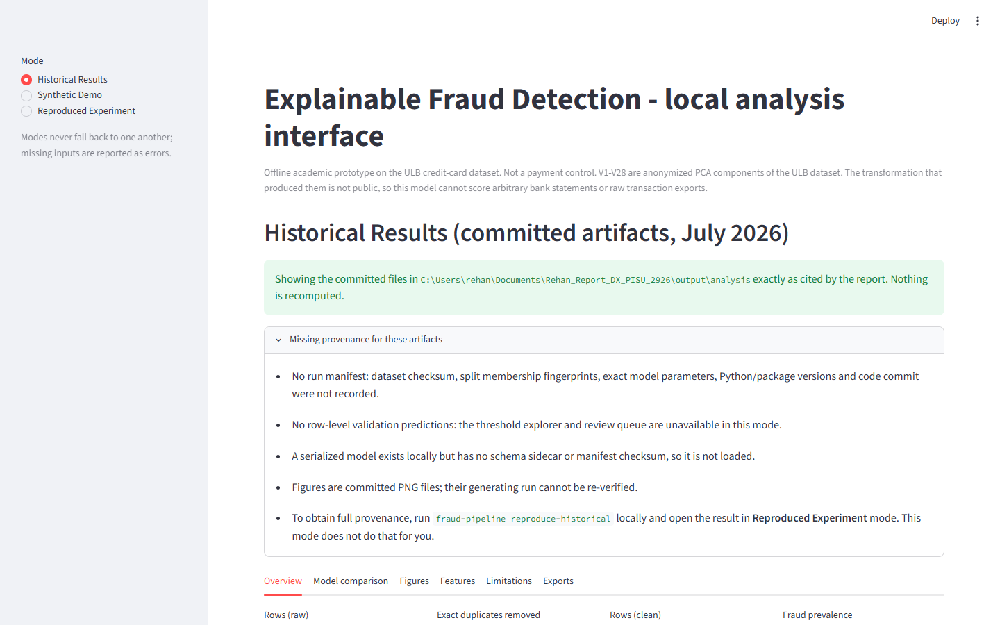
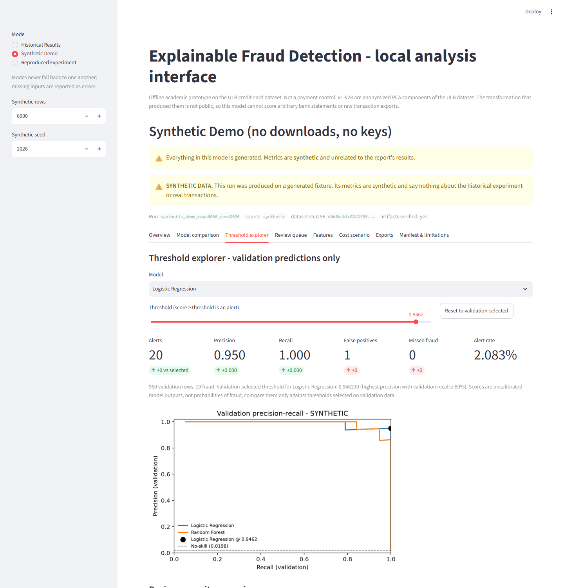
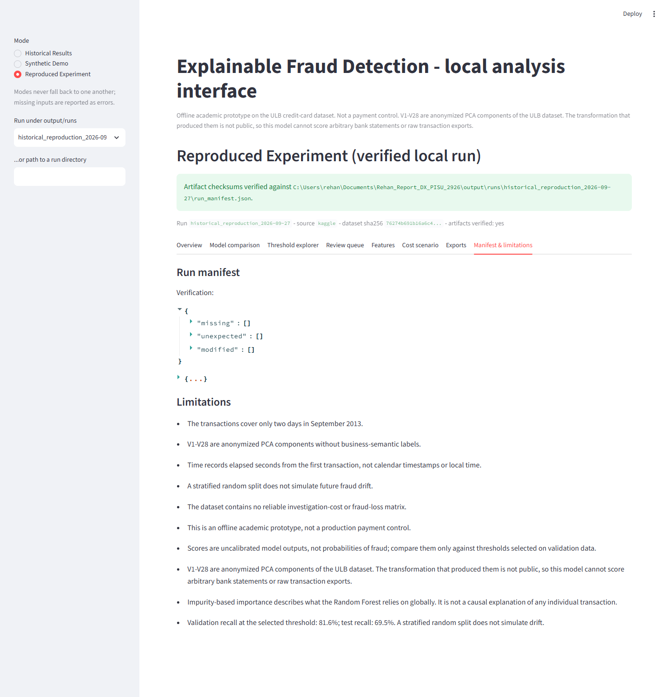

# Local UI guide

A small Streamlit interface over the `fraud_pipeline` core and its verified artifacts. It runs entirely on your machine: no accounts, no telemetry, no external model or LLM calls, no deployment.



## Launch

```bash
# once
python -m venv .venv && source .venv/bin/activate      # Windows: .venv\Scripts\Activate.ps1
pip install -r requirements-dev.txt -e .

# every time
streamlit run src/fraud_pipeline/ui/app.py
```

The browser opens at <http://localhost:8501>. Nothing is trained at startup. Stop with `Ctrl+C`.

Optional environment overrides (mainly for tests): `FRAUD_UI_HISTORICAL_DIR`, `FRAUD_UI_RUNS_ROOT`, `FRAUD_UI_DEMO_ROOT`.

## Modes

Modes never fall back to one another. If a mode's inputs are missing or fail verification you see an error, not another mode's data.

| Mode | Data shown | Needs | What it cannot do |
|---|---|---|---|
| **Historical Results** | The committed July-2026 files in `output/analysis/` (metrics, figures, feature importance), exactly as cited by the report | Nothing beyond the repository | No threshold explorer or review queue: the historical export has no row-level validation predictions. The panel *Missing provenance* lists everything that was not recorded (no manifest, no dataset checksum, no environment record, model file not loadable). |
| **Synthetic Demo** | A run on a deterministic synthetic fixture created **once** (button) and reused afterwards; every screen carries a SYNTHETIC banner | Nothing; no downloads or keys | Says nothing about real transactions or the report's numbers |
| **Reproduced Experiment** | A run directory under `output/runs/` produced by `fraud-pipeline reproduce-historical` (or `fraud-pipeline run`), opened only after manifest, checksum and version checks pass | The Kaggle CSV and ~5 minutes to produce the run locally | Rejects synthetic runs, tampered artifacts, unknown manifest versions and directories without a manifest |



## Tabs (run-backed modes)

- **Overview** - dataset quality (rows, duplicates removed, class counts, prevalence, Time-column note), split summary with membership fingerprints, model selection basis.
- **Model comparison** - the frozen test-set table for Dummy Prior, Logistic Regression and Random Forest at the default 0.5 and the validation-selected operating point. `average_precision` and `pr_auc_trapezoidal` are separate columns on purpose.
- **Threshold explorer** - operates on **validation predictions only**. Slider or reset to the validation-selected threshold; alerts, precision, recall, false positives, missed fraud, alert rate, deltas versus the selected point; validation PR curves; review-capacity scenarios (threshold at the N-th highest score, realised alert count shown because ties can exceed N). Below it the **frozen test result** is repeated and locked: moving the slider never re-evaluates the test set, and an explored threshold is not a newly validated operating point.
- **Review queue** - the flagged validation rows at the explorer threshold, highest score first. Ground-truth labels are hidden by default and, when revealed, appear in a column named `ground_truth_label`; analyst annotations (`confirmed_fraud`, `legitimate`, `escalate`) live in a separate store and CSV export. Optionally loads the transaction features from the source CSV after verifying its SHA-256 against the manifest. No retraining happens. Local additive explanations are offered only for the Logistic Regression pipeline, naming `V*` as anonymized PCA components.
- **Features** - global Random Forest impurity importance, labelled as model reliance rather than individual causal explanation.
- **Cost scenario** - requires an explicit acknowledgement and your own hypothetical unit costs; the output is labelled a scenario, never realized savings.
- **Exports** - download the analytical report (Markdown) and the configuration (JSON), or save both under `output/ui_exports/`. See [`example_report_synthetic.md`](example_report_synthetic.md) and [`example_config_synthetic.json`](example_config_synthetic.json).
- **Manifest & limitations** - the full run manifest, the verification result, the limitations list and the validation-vs-test recall gap.



## Input handling and safety

- Run directories are accepted only if they contain `run_manifest.json`, every artifact digest matches, the manifest version is supported and `validation_scores.csv` holds validation rows with 0/1 labels and unique row ids. `validation_scores.csv` is capped at 1,000,000 rows and the source CSV at 600 MB.
- Model artifacts are loaded only through `fraud_pipeline.artifacts.load_model_bundle` (schema sidecar + manifest checksum). Uploaded or arbitrary pickle/joblib files are never loaded.
- The UI does not accept bank statements or transaction exports. `V1`-`V28` are anonymized PCA components whose transformation is not public, so the model cannot score other data.
- Scores are uncalibrated model outputs, not fraud probabilities.

## Tests

```bash
pytest -q tests/test_ui_core.py tests/test_ui_app.py
```

`test_ui_core.py` checks every UI calculation against the core evaluation functions, loader error states (missing manifest, tampered artifact, wrong split, incompatible version, checksum mismatch), split separation, annotation separation and exports. `test_ui_app.py` drives the app headlessly with `streamlit.testing.v1.AppTest` through all three modes and their error paths.
